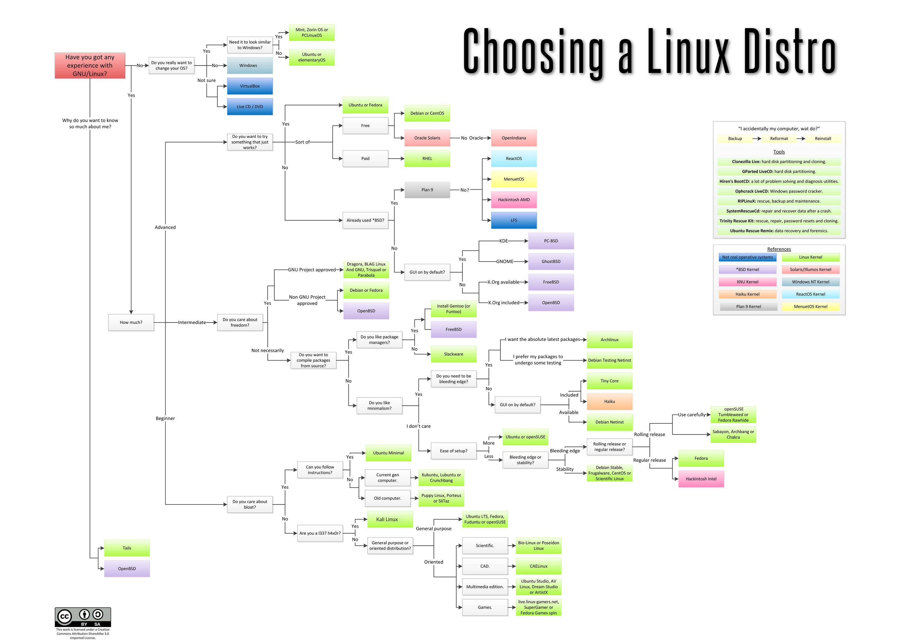

- [TuxWars Class - 1](#tuxwars-class---1)
    - [Slides](#slides)
    - [Resources](#resources)
    - [Commands to try out(most common utilites)](#commands-to-try-outmost-common-utilites)
    - [An IDM equivalent on linux ?](#someone-asked-me-an-idm-equivalent-on-linux-)
    - [Centos ISO](#centos-iso)
    - [Ubuntu ISO](#ubuntu-iso)

# TuxWars Class - 1

## Slides
Click [here](2018_08_24_TuxWars-1.pdf) to download the slides for this class

## Resources

- Download the **The linux command line** (TLCL) book : [here](http://sourceforge.net/projects/linuxcommand/files/TLCL/17.10/TLCL-17.10.pdf/download)
- Check out linux distro watch : [here](https://distrowatch.com/dwres.php?resource=popularity)
- File system Hierarchy 3.0 : [here](https://refspecs.linuxfoundation.org/FHS_3.0/fhs-3.0.pdf)
- IO Redirection : [here at tldp](https://www.tldp.org/LDP/abs/html/io-redirection.html) { btw : tldp is an excellent resource :) }
- Booting Process :
    - [here at slashroot.in](https://www.slashroot.in/linux-booting-process-step-step-tutorial-understanding-linux-boot-sequence)
    - [here at IBM developer works](https://www.ibm.com/developerworks/library/l-linuxboot/index.html) : it is one of [my](https://github.com/packetChor) favourite resource to study about linux/unix. Really a good resource. Checkout their other articles as well.
- Wildcards :
    - [read here](http://tldp.org/LDP/GNU-Linux-Tools-Summary/html/x11655.htm) at tldp
    - [see it in action at techmint.com](https://www.tecmint.com/use-wildcards-to-match-filenames-in-linux/) : [I](https://github.com/packetChor) personally find techmint very helpful, they have really nice articles/demos. Checkout their other articles as well

## Commands to try out(most common utilites)

1. man 
2. echo (echo -n)
3. pwd
4. cd (cd -)
5. ls
6. mkdir
7. touch
8. cp
9. whoami
10. sort
11. less

## Someone asked me an IDM equivalent on linux ?

- install 'aria2c' utility on your linux system
- Try this : aria2c -x 16 -s 16 'download_url'
    - it attempts to create 16 connections to download the file specified by download_url.
    -  -x, --max-connection-per-server=<NUM>
    -  -s, --split=<N> of connections to the same host

## Centos ISO
Download latest ISO of centos here :
    [https://www.centos.org/download/](https://www.centos.org/download/)

## Ubuntu ISO
Download latest ISO of ubuntu here :
    [https://www.ubuntu.com/download/desktop](https://www.ubuntu.com/download/desktop)

Download this image [here](choosing-a-linux-distro.jpg)
