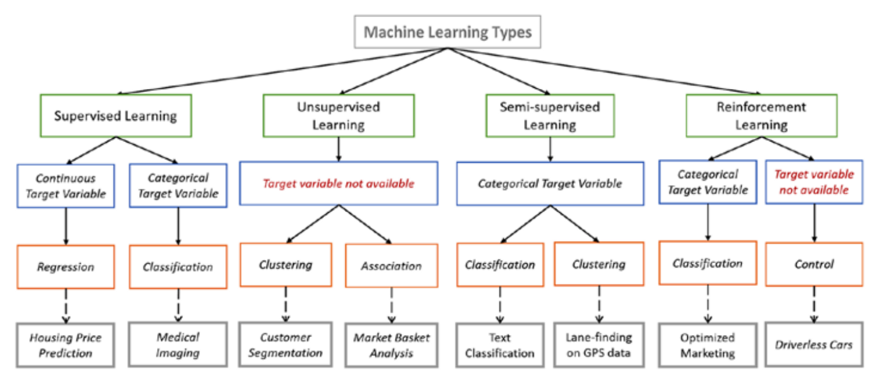

- [Introduction](#introduction)
    - [Why learn ML ?](#why-learn-ml-)
    - [What is ML ?](#what-is-ml-)
        - [learning(machine learning) is not memorisation:](#learningmachine-learning-is-not-memorisation)
    - [When to apply ML ?](#when-to-apply-ml-)
        - [1. Pattern exists](#1-pattern-exists)
        - [2. Cannot pin down the pattern mathematically](#2-cannot-pin-down-the-pattern-mathematically)
        - [3. Have enough Data](#3-have-enough-data)
    - [Lets do the "hello world" of ML](#lets-do-the-hello-world-of-ml)
    - [What does a Machine Learning Algo constitute of?](#what-does-a-machine-learning-algo-constitute-of)
    - [A non-exhaustive Classification of Machine Learning Algorithms:](#a-non-exhaustive-classification-of-machine-learning-algorithms)
- [Implementation Of ML](#implementation-of-ml)
    - [Language of choice](#language-of-choice)
    - [Python Libraries for handling and visualising data](#python-libraries-for-handling-and-visualising-data)
    - [Common Frameworks :](#common-frameworks-)
    - [Linear Regression Class Slides](#linear-regression-class-slides)
    - [Useful resources :](#useful-resources-)

# Introduction 

Most problems in real world are mathematical or can be reduced to one. These problems reduce to converting an input(s), after applying some form of logic, to a desired output (i.e a finding a functional mapping). Now if the underlying logic of the function :

1. Is known -> easy peezy -> then Explicitly program the logic
    - eg. problems on codechef/SPOJ etc. hard-logic
2. Is not known
    - ML **can** be attempted....[When can it be attempted?](#when-to-apply-ml-)

## Why learn ML ?

According to a report from IBM, in 2015 there were 2.35 million openings for data analytics jobs in the US. It estimates that number will rise to 2.72 million by 2020.

## What is ML ?

> Provides machines the ability to automatically *learn and improve from experience(can be in form of data)* without being explicitly programmed.

Real world examples :
- want to tag <insert_friend_name> ? on facebook
- smart (google) maps 
- predictive keyboards

### learning(machine learning) is not memorisation:

> learning is to figure out a pattern that applies to outside (unseen) datapoints.
> memorisation is to just cram the data *(called overfitting)*, so that pattern only applies to the given dataset, and no guarentee can be made for its performance on unseen data.

## When to apply ML ?

### 1. Pattern exists
- If the problem didn't have an underlying pattern, you can still try learning. Though you will certainly fail in such a case. We can always apply/try machine learning regardless of whether there is an underlying pattern or not.
- How do we know if there is a pattern ?
- you can only know it by two ways:Visualising the data
    - hit and trial (just try an algo)
    - There is something that you can actually measure called the **performance metric** that will tell you if you learned or not.
- There is no harm done in trying machine learning

### 2. Cannot pin down the pattern mathematically
- If you can pin down the pattern mathematically/ explicitly, then machine learning will still work, BUT it is certainly not a wise/optimal way to solve that problem.

### 3. Have enough Data
- If you don't have relevant data -> **THEN MACHINE LEARNING IS NOT POSSIBLE**

## Lets do the "hello world" of ML

**Linear regression**

- for given dataset(x,y) where x is an independent variable, and y is a continuous target variable.

## What does a Machine Learning Algo constitute of?

1. Model
    1. Input data points
    2. Examples of Expected Output(supervised learning)
    3. Values that the model generates at the supplied input data points
2. Performance Metric (a feedback signal to adjust the way the ML algorithm works)
    - This is what is called **LEARNING -or- MACHINE LEARNING**.
3. Loss function
4. Optimiser

## A non-exhaustive Classification of Machine Learning Algorithms:

Some commonly used **basic** machine learning algorithms. These algorithms may be applied to almost any data problem:

1. Linear Regression
2. Logistic Regression
3. Decision Tree
4. SVM
5. Naive Bayes
6. kNN
7. K-Means
8. Random Forest
9. Dimensionality Reduction Algorithms
10. Gradient Boosting algorithms
    - GBM
    - XGBoost
    - LightGBM
    - CatBoost
    - AdaBoost

# Implementation Of ML

requires a powerful programming language, use of existing frameworks.

## Language of choice
1. R (strictly for data science)
2. python (+ added benefits)
3. Matlab/octave(prototyping algorithms , never used in production systems)

We will prefer python(3) during the course of LR classes as it has a smooth learning curve, and almost all open source frameworks support python:

Apart from the frameworks you would also need to study a few lower level python libraries to handle the datasets:

## Python Libraries for handling and visualising data
1. numpy
2. scipy
3. pandas
4. matplotlib
5. seaborn
6. plotly

## Common Frameworks :
1. scikit-learn (easy of use, easy experimentation)
2. tensorflow
3. theano
4. keras (HIGH-level framework for mainly for DL)
5. pytorch
6. caffe
7. microsoft's CNTK

## Linear Regression Class Slides

Click [here](04_LinearRegression.pdf) for linear regression slides.
> Note : it contains extra topics, which were not covered in the class.

## Useful resources :

- API documentation in one place : [devdocs.io](https://devdocs.io)
- Free GPU for 12hrs at a time, after which your VM instance would be reset(you will have to rerun your code again after 12 hrs)[google colab](https://colab.research.google.com/)
- Basic course for learning machine learning algorithms : [Andrew Ng's Course](https://www.coursera.org/learn/machine-learning/home/welcome). Though for the purpose of logical rhythmm you can skip the matlab exercises, and try things in python instead. Choice is your's to make.
- [What is probability distribution](https://www.analyticsvidhya.com/blog/2017/09/6-probability-distributions-data-science/)
- [More on probability distributions](https://medium.com/@srowen/common-probability-distributions-347e6b945ce4)
- Blog's to follow :
    - [analytics vidhya](https://www.analyticsvidhya.com/)
    - [towardsdatascience](http://towardsdatascience.com)

> WILL UPDATE THIS ARTICLE WITH MORE RESOURCES